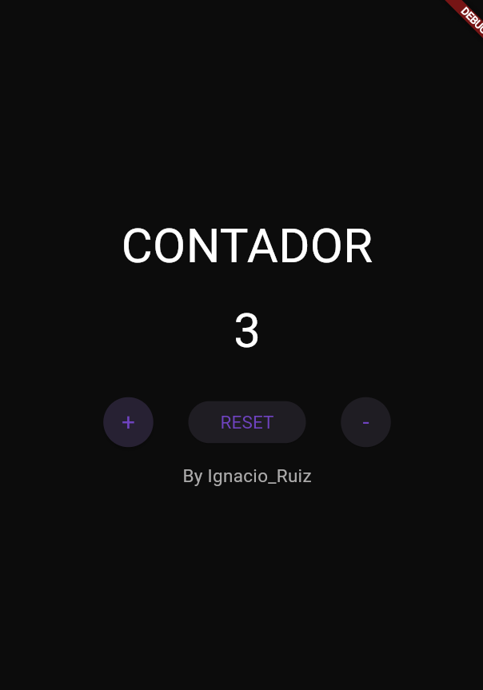
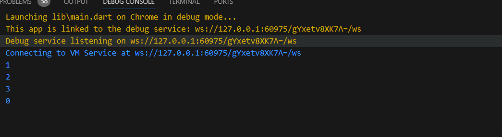
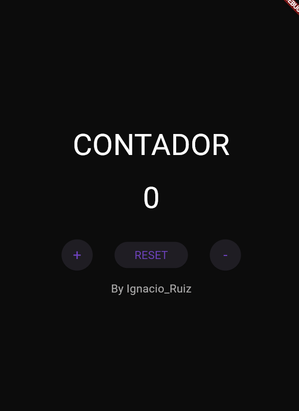

# ruiz_idigoras_e02

# Contador Flutter

Este es un proyecto Flutter simple que implementa un contador con botones de incremento, reinicio y decremento.

## Descripción

La aplicación consta de una pantalla principal (`ContadorScreen`) con un título "CONTADOR", un valor de contador, botones para incrementar, reiniciar y decrementar el contador, y la información del desarrollador al final.

## Características

- **Botón de incremento:** Aumenta el valor del contador.
- **Botón de reinicio:** Restablece el valor del contador a cero.
- **Botón de decremento:** Disminuye el valor del contador.

## Uso

1. Clona este repositorio: `git clone https://github.com/tuusuario/contador_flutter.git`
2. Abre el proyecto en un entorno de desarrollo de Flutter.
3. Ejecuta la aplicación en tu dispositivo o emulador.

## Imagenes

!ScreenShot

## Dependencias

- Flutter: Versión 3.16.5
- Dart: Versión 3.2.3

## Contribuir

Si encuentras algún error o tienes alguna sugerencia, siéntete libre de abrir un problema o enviar un pull request.

## Autor

- [Ignacio Ruiz](https://github.com/IgnacioRuiz01)

## Licencia

Este proyecto está bajo la Licencia MIT.

## Getting Started

This project is a starting point for a Flutter application.

A few resources to get you started if this is your first Flutter project:

- [Lab: Write your first Flutter app](https://docs.flutter.dev/get-started/codelab)
- [Cookbook: Useful Flutter samples](https://docs.flutter.dev/cookbook)

For help getting started with Flutter development, view the
[online documentation](https://docs.flutter.dev/), which offers tutorials,
samples, guidance on mobile development, and a full API reference.
